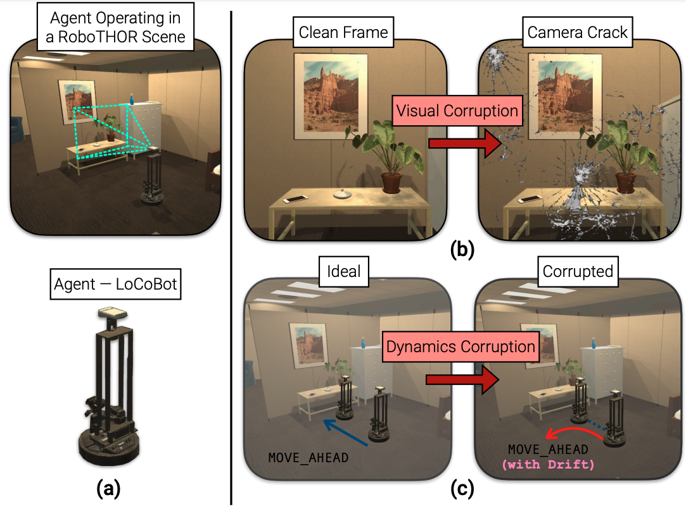
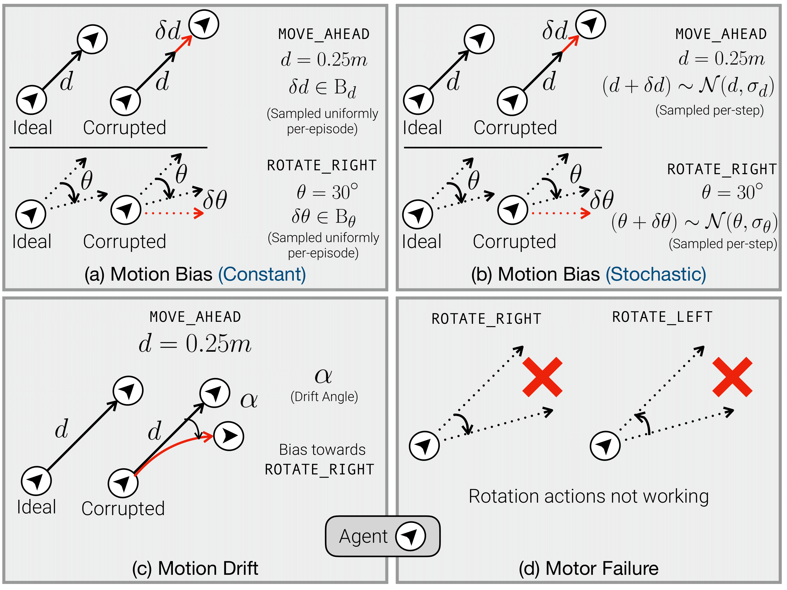

# <a href="https://prior.allenai.org/projects/robustnav">RobustNav: Towards Benchmarking Robustness in Embodied Navigation</a>

#### Prithvijit Chattopadhyay, Judy Hoffman, Roozbeh Mottaghi, Ani Kembhavi

#### <a href="https://prior.allenai.org/projects/robustnav">(Project Page)</a>

As an attempt towards assessing the robustness of embodied navigation agents, we propose <b>RobustNav</b>, a
framework to quantify the performance of embodied navigation agents when exposed to a wide variety of visual
– affecting RGB inputs – and dynamics – affecting transition dynamics – corruptions. Most recent efforts in visual
navigation have typically focused on generalizing to novel
target environments with similar appearance and dynamics characteristics. With <b>RobustNav</b>, we find that some
standard embodied navigation agents significantly underperform (or fail) in the presence of visual or dynamics corruptions. We systematically analyze the kind of idiosyncrasies that emerge in the behavior of such agents when operating under corruptions. Finally, for visual corruptions
in <b>RobustNav</b>, we show that while standard techniques
to improve robustness such as data-augmentation and self-supervised adaptation offer some zero-shot resistance and
improvements in navigation performance, there is still a
long way to go in terms of recovering lost performance relative to clean “non-corrupt” settings, warranting more research in this direction.

RobustNav is based on <a href=https://allenact.org/>AllenAct</a> framework and the majority of the core training algorithms and pipelines are borrowed from a specific commit of the <a href=https://github.com/allenai/allenact>AllenAct code base</a>.

<!-- ### Citation

If you find this project useful in your research, please consider citing:

```
   @inproceedings{ehsani2021manipulathor,
     title={ManipulaTHOR: A Framework for Visual Object Manipulation},
     author={Ehsani, Kiana and Han, Winson and Herrasti, Alvaro and VanderBilt, Eli and Weihs, Luca and Kolve, Eric and Kembhavi, Aniruddha and Mottaghi, Roozbeh},
     booktitle={CVPR},
     year={2021}
   }
``` -->

### Contents

<div class="toc">
<ul>
<li><a href="#-installation">💻 Installation</a></li>
<li><a href="#-robustnav-description">📝 RobustNav Description</a></li>
<li><a href="#-visual-corruptions">🖼️ Visual Corruptions</a></li>
<li><a href="#-dynamics-corruptions">🏃 Dynamics Corruptions</a></li>
<li><a href="#-dataset">📊 Dataset</a></li>
<li><a href="#-training-an-agent">🏋 Training an Agent</a></li>
<li><a href="#-evaluating-a-pre-trained-agent">💪 Evaluating a Pre-Trained Agent</a></li>
</ul>
</div>

## 💻 Installation

1. First install [Anaconda](https://docs.anaconda.com/anaconda/install/linux/)

2. To begin, clone this repository locally

```bash
git clone https://github.com/allenai/robustnav.git
```

3. You can then install requirements inside a conda environment by running

```bash
conda env create --file robustnav.yml --name <ENV-NAME>
```

where `ENV-NAME` is the name of the environment. The default environment name is `robustnav` if `ENV-NAME` is not specified.

4. Activate the conda environment by running

```bash
conda activate <ENV-NAME>
```

or

```bash
conda activate robustnav
```

**Python 3.6+ 🐍.** Each of the actions supports `typing` within <span class="chillMono">Python</span>.

**AI2-THOR <bcc2e6> 🧞.** To ensure reproducible results, please install the version of the AI2THOR present in `robustnav.yml`.

After installing the requirements, you should start the xserver by running [this script](scripts/startx.py) in the background.

## 📝 RobustNav Description



RobustNav is a framework to evaluate pre-trained navigation agents in the presence of a wide variety of visual and dynamics corruptions. As such, this codebase supports training (in line with AllenAct) and evaluating PointNav
and ObjectNav agents (either RGB and / or Depth observations) in unseen environments where visual and dynamics corruptions have been applied. For instance, in the above example, a (LoCoBot based) agent trained in a set
of clean environments (see (a)), is evaluated in environments with Camera-Crack and Motion Drift as the visual and dynamics corruptions respectively (see (b) and (c)).

## 🖼️ Visual Corruptions


As highlighted in the figure above, RobustNav supports 7 visual corruptions --
Defocus Blur, Motion Blur, Spatter, Camera Crack, Low Lighting, Lower FOV and Speckle Noise. The above figure represents "clean" and "corrupt" egocentric RGB frames as viewed by the agent. Among these corruptions, Defocus Blur, Motion Blur, Spatter, Low Lighting and Speckle Noise are supported at 5 progressively increasing levels of severity. Defocus Blur, Spatter and Speckle Noise are akin to the visual corruptions introduced <a href="https://arxiv.org/abs/1903.12261">here</a>. Note that these corruptions are applied only on the RGB observations (not Depth).

## 🏃 Dynamics Corruptions



As highlighted above, RobustNav includes 4 dynamics corruptions -- (a) Motion Bias (Constant), (b) Motion Bias (Stochastic), (c) Motion Drift and (d) Motor Failure. Motion Bias (Constant & Stochastic) are intended to model scene-level friction and high and low friction zones in the environment. Motion Drift models a setting where translation (forward) has a slight bias towards turning left or right. In Motor Failure, one of the rotation actions fail.

PointNav agents have the following actions available to them -- `MoveAhead` (0.25m), `RotateLeft` (30&deg;), `RotateRight` (30&deg;) and `End` (end an episode). ObjectNav agents additionally have access to `LookUp` and `LookDown` actions -- indicating change in agent's view above or below the horizon.

## 📊 Dataset

Agents in RobustNav are trained and evaluated on the RoboTHOR set of scenes. RoboTHOR consists of 60 training and 15 validation environments. Agents are trained on the train set of environments are evaluated on the validation set of environments. Evaluation episodes are present in `datasets/robothor-pointnav/robustnav_eval/` for PointNav and `datasets/robothor-objectnav/robustnav_eval/` for ObjectNav. For ObjectNav, we consider 12 object categories -- AlarmClock, Apple, BaseBallBat, BasketBall, Bowl, GarbageCan, HousePlant, Laptop, Mug, SprayBottle, Television and Vase.

## 🏋 Training An Agent

To train an agent, we rely on the experiment configs located [here](projects/robustnav_baselines/experiments/robustnav_train/). Upon activating the robustnav anaconda environment, run the following command to train an agent:

```
python main.py \
    -o storage/<EXPERIMENT-STORAGE-DIRECTORY> \
    -b projects/robustnav_baselines/experiments/robustnav_train <EXPERIMENT-CONFIG> \
    -s <RANDOM-SEED> \
    -et <EXPERIMENT-STRING-TAG-IDENTIFIER>
```

For instance, to train a PointNav RGB agent, the command is:

```
python main.py \
    -o storage/robothor-pointnav-rgb-resnetgru-ddppo \
    -b projects/robustnav_baselines/experiments/robustnav_train pointnav_robothor_vanilla_rgb_resnet_ddppo \
    -s 12345 \
    -et rnav_pointnav_vanilla_rgb_resnet_ddppo_clean
```

Checkpoints over the course of training will be stored under `storage/robothor-pointnav-rgb-resnetgru-ddppo/checkpoints/` and tensorboard logs will be stored under `storage/robothor-pointnav-rgb-resnetgru-ddppo/tb/`.

If you have Tensorboard installed, you can track training progress with

```bash
tensorboard --logdir storage/robothor-pointnav-rgb-resnetgru-ddppo/tb/
```

which will default to the URL [http://localhost:6006/](http://localhost:6006/).

To see commands used to train the navigation agents considered in the paper, see `train_navigation_agents.sh`

## 💪 Evaluating A Pre-Trained Agent

To evaluate pre-trained navigation agents, first run [this](rnav_checkpoints/download_checkpoints.sh) script to download all the checkpoints.

For evaluation, we will consider evaluating an agent under (1) clean settings, (2) under visual corruptions, (3) under dynamics corruptions and (4)under visual + dynamics corruptions. We will consider evaluating a pre-trained PointNav RGB agent as the running example.

### Clean Settings

To evaluate under clean settings, run the following command:

```
python main.py \
    -o <METRIC-STORAGE-DIRECTORY> \
    -b projects/robustnav_baselines/experiments/robustnav_eval <EXPERIMENT-CONFIG> \
    -c <CHECKPOINT-PATH> \
    -t <CHECKPOINT-TIMESTAMP> \
    -et <EXPERIMENT-STRING-TAG-IDENTIFIER> \
    -s <RANDOM-SEED> \
    -e \
    -tsg <GPU-ID>
```

For a PointNav RGB agent, this is equivalent to:

```
python main.py \
    -o storage/robothor-pointnav-rgb-resnetgru-ddppo-eval \
    -b projects/robustnav_baselines/experiments/robustnav_eval pointnav_robothor_vanilla_rgb_resnet_ddppo \
    -c rnav_checkpoints/pnav_rgb_agent.pt \
    -t 2021-03-02_05-58-58 \
    -et rnav_pointnav_vanilla_rgb_resnet_ddppo_clean \
    -s 12345 \
    -e \
    -tsg 0
```

The output trajectories and associated metrics per episode will be stored under `storage/robothor-pointnav-rgb-resnetgru-ddppo-eval/metrics/`.

### Visual Corruptions

For visual corruptions, when evaluating under Defocus Blur, Motion Blur, Spatter, Low Lighting and Speckle Noise, we have two additional command line arguments `-vc` and `-vs` identifying the kind and severity of the corruptions. For instance, to evaluate under Defocus Blur, the command is:

```
python main.py \
    -o storage/robothor-pointnav-rgb-resnetgru-ddppo-eval \
    -b projects/robustnav_baselines/experiments/robustnav_eval pointnav_robothor_vanilla_rgb_resnet_ddppo \
    -c rnav_checkpoints/pnav_rgb_agent.pt \
    -t 2021-03-02_05-58-58 \
    -et rnav_pointnav_vanilla_rgb_resnet_ddppo_Defocus_Blur_s5 \
    -s 12345 \
    -e \
    -tsg 0 \
    -vc Defocus_Blur \
    -vs 5
```

When evaluating under Lower-FOV, run:

```
python main.py \
    -o storage/robothor-pointnav-rgb-resnetgru-ddppo-eval \
    -b projects/robustnav_baselines/experiments/robustnav_eval pointnav_robothor_vanilla_rgb_resnet_ddppo_fov \
    -c rnav_checkpoints/pnav_rgb_agent.pt \
    -t 2021-03-02_05-58-58 \
    -et rnav_pointnav_vanilla_rgb_resnet_ddppo_fov \
    -s 12345 \
    -e \
    -tsg 0
```

When evaluating under Camera-Crack, run:

```
python main.py \
    -o storage/robothor-pointnav-rgb-resnetgru-ddppo-eval \
    -b projects/robustnav_baselines/experiments/robustnav_eval pointnav_robothor_vanilla_rgb_resnet_ddppo_cam_crack \
    -c rnav_checkpoints/pnav_rgb_agent.pt \
    -t 2021-03-02_05-58-58 \
    -et rnav_pointnav_vanilla_rgb_resnet_ddppo_cam_crack \
    -s 12345 \
    -e \
    -tsg 0
```

### Dynamics Corruptions

When evaluating under Motion Bias (Constant), run:

```
python main.py \
    -o storage/robothor-pointnav-rgb-resnetgru-ddppo-eval \
    -b projects/robustnav_baselines/experiments/robustnav_eval pointnav_robothor_vanilla_rgb_resnet_ddppo_dyn \
    -c rnav_checkpoints/pnav_rgb_agent.pt \
    -t 2021-03-02_05-58-58 \
    -et rnav_pointnav_vanilla_rgb_resnet_ddppo_clean_mb_const \
    -s 12345 \
    -e \
    -tsg 0 \
    -dcr True \
    -ctr True \
    -crt True
```

`-dcr` is set to `True` for Motion Bias, Motion Drift and Motor Failure. `-ctr` is set to `True` for constant translation bias and `-crt` is set to `True` for constant rotation bias.

When evaluating under Motion Bias (Stochastic), run:

```
python main.py \
    -o storage/robothor-pointnav-rgb-resnetgru-ddppo-eval \
    -b projects/robustnav_baselines/experiments/robustnav_eval pointnav_robothor_vanilla_rgb_resnet_ddppo_dyn \
    -c rnav_checkpoints/pnav_rgb_agent.pt \
    -t 2021-03-02_05-58-58 \
    -et rnav_pointnav_vanilla_rgb_resnet_ddppo_clean_mb_stoch \
    -s 12345 \
    -e \
    -tsg 0 \
    -dcr True \
    -str True \
    -srt True
```

`-str` is set to `True` for stochastic translation bias and `-srt` is set to `True` for stochastic rotation bias.

When evaluating under Motion Drift, run:

```
python main.py \
    -o storage/robothor-pointnav-rgb-resnetgru-ddppo-eval \
    -b projects/robustnav_baselines/experiments/robustnav_eval pointnav_robothor_vanilla_rgb_resnet_ddppo_dyn \
    -c rnav_checkpoints/pnav_rgb_agent.pt \
    -t 2021-03-02_05-58-58 \
    -et rnav_pointnav_vanilla_rgb_resnet_ddppo_clean_drift_deg_10 \
    -s 12345 \
    -e \
    -tsg 0 \
    -dcr True \
    -dr True \
    -dr_deg 10.0
```

`-dr` is set to `True` for motion drift and `-dr_deg` is set to `10.0` as the drift angle.

When evaluating under Motor Failure, run:

```
python main.py \
    -o storage/robothor-pointnav-rgb-resnetgru-ddppo-eval \
    -b projects/robustnav_baselines/experiments/robustnav_eval pointnav_robothor_vanilla_rgb_resnet_ddppo_dyn \
    -c rnav_checkpoints/pnav_rgb_agent.pt \
    -t 2021-03-02_05-58-58 \
    -et rnav_pointnav_vanilla_rgb_resnet_ddppo_clean_motfail \
    -s 12345 \
    -e \
    -tsg 0 \
    -dcr True \
    -mf True
```

`-mf` is set to `True` for motor failure.

When evaluating under PyRobot noise models from <a href="https://arxiv.org/abs/1906.08236">here</a>, run:

```
python main.py \
    -o storage/robothor-pointnav-rgb-resnetgru-ddppo-eval \
    -b projects/robustnav_baselines/experiments/robustnav_eval pointnav_robothor_vanilla_rgb_resnet_ddppo_pyrobot_dyn \
    -c rnav_checkpoints/pnav_rgb_agent.pt \
    -t 2021-03-02_05-58-58 \
    -et rnav_pointnav_vanilla_rgb_resnet_ddppo_clean_pyrobot_ilqr_1 \
    -s 12345 \
    -e \
    -tsg 0
```

Note that the experiment config used for PyRobot settings is different from the ones used for Motion Bias, Motion Drift and Motor Failure. To evaluate other agents which differ either in terms of the task (PointNav&#8594;ObjectNav) or sensors (RGB&#8594;RGB-D), just pick the corresponding experiment configs and checkpoints under `projects/robustnav_baselines/experiments/robustnav_eval/` and `rnav_checkpoints/` respectively. These instructions are also highlighted in `eval_navigation_agents.sh`.

If you use the PyRobot noise models, please cite:

```
@article{murali2019pyrobot,
  title={Pyrobot: An open-source robotics framework for research and benchmarking},
  author={Murali, Adithyavairavan and Chen, Tao and Alwala, Kalyan Vasudev and Gandhi, Dhiraj and Pinto, Lerrel and Gupta, Saurabh and Gupta, Abhinav},
  journal={arXiv preprint arXiv:1906.08236},
  year={2019}
}

```

### Visual + Dynamics Corruptions

To evaluate in the presence of visual and dynamics corruptions, use the additional `-vc` and `-vs` arguments to highlight the kind and severity of visual corruption in the commands used to evaluate under dynamics corruptions (above). For instance, to evaluate under Defocus Blur + Motion Drift, the command is:

```
python main.py \
    -o storage/robothor-pointnav-rgb-resnetgru-ddppo-eval \
    -b projects/robustnav_baselines/experiments/robustnav_eval pointnav_robothor_vanilla_rgb_resnet_ddppo_dyn \
    -c rnav_checkpoints/pnav_rgb_agent.pt \
    -t 2021-03-02_05-58-58 \
    -et rnav_pointnav_vanilla_rgb_resnet_ddppo_clean_drift_deg_10 \
    -s 12345 \
    -e \
    -tsg 0 \
    -dcr True \
    -dr True \
    -dr_deg 10.0 \
    -vc Defocus_Blur \
    -vs 5
```

To find the time-stamps associated with all the checkpoints, refer to `eval_navigation_agents.sh`.
